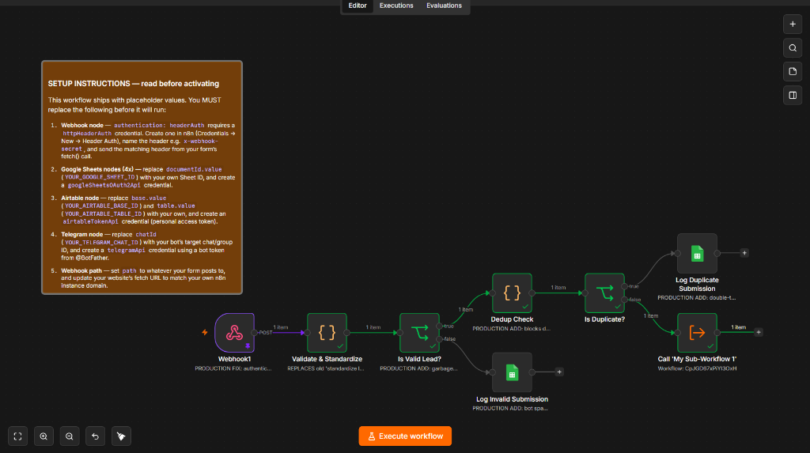
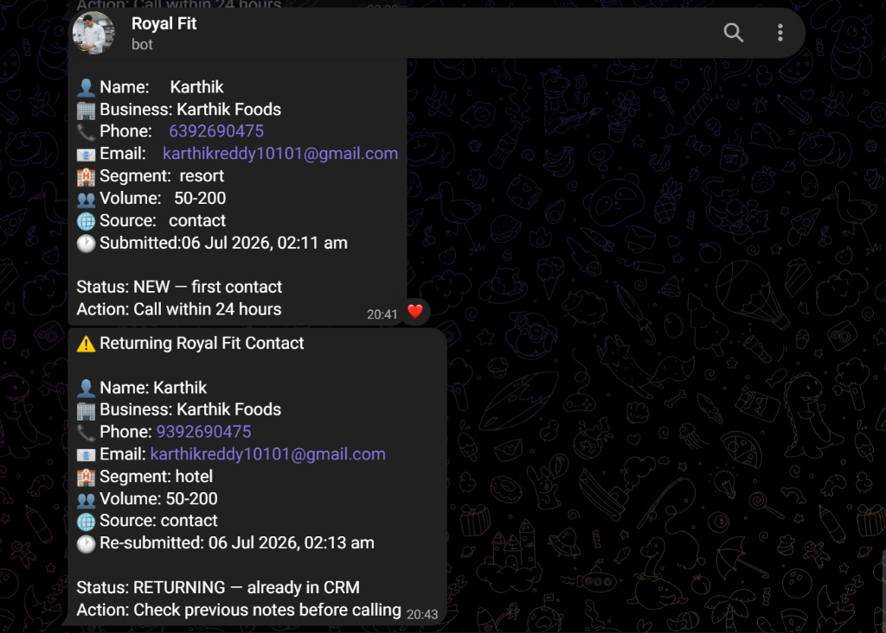
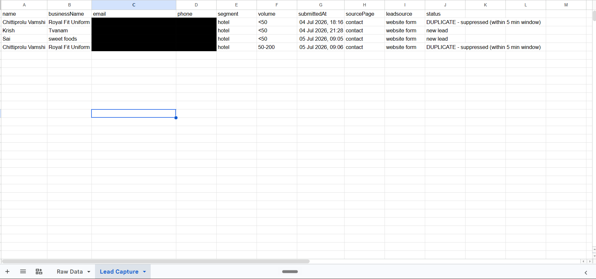
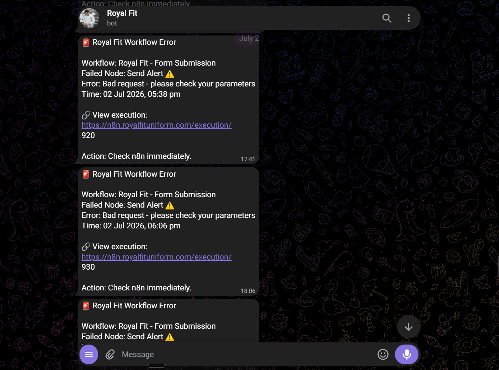
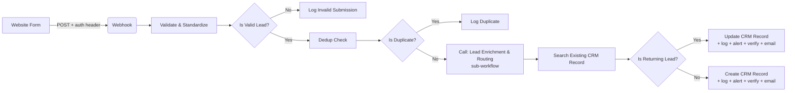
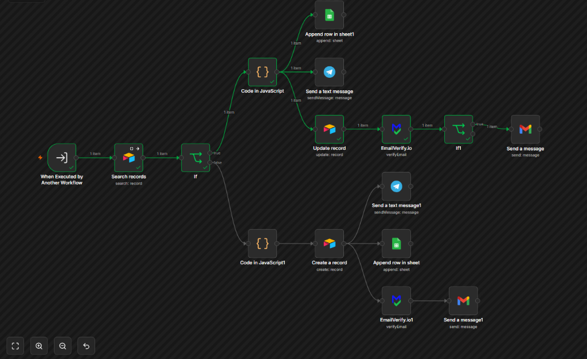
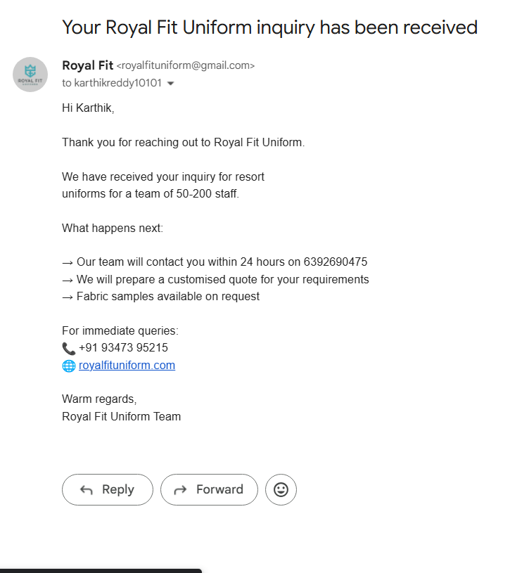
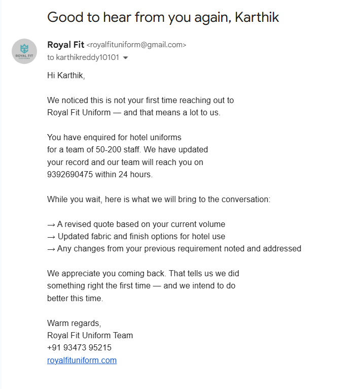

# Production Lead Pipeline for a B2B Uniform Supplier

**Stack:** n8n (self-hosted) · Google Sheets · Airtable · Telegram Bot API · JavaScript

A GTM system I built and run for Royal Fit Uniform, a real B2B supplier serving
hotels, hospitals, and hospitality chains across South India. This isn't a demo
workflow — it's the actual pipeline that catches every inbound lead from the
website and turns it into a CRM record and a real-time team alert, with its own
error-monitoring layer watching it in production.



---

### The problem

A lead fills out a form on the website. From there, three things need to happen
reliably: the lead needs to land in the CRM correctly, the team needs to know
about it within seconds, and none of that should ever silently fail without
someone finding out.

### The system

```text
Website Form → Webhook (authenticated) → Validate & Standardize
     → Duplicate check (5-min window)
          → Google Sheets (audit log)
          → Telegram (instant team alert)
          → Airtable (CRM record)

Any failure anywhere → dedicated error workflow
     → Telegram alert + error log, with a direct link to the failed execution
```

Every inbound POST is authenticated with a shared secret header. Malformed or
incomplete submissions are validated out before they ever touch the CRM.
Duplicate submissions — someone double-tapping "Submit" on a slow connection —
are caught and logged instead of creating two CRM records and firing two alerts.



### The bug that made this worth writing about

Partway through running this in production, I found that the Airtable node was
writing every lead's phone number field from the *segment* value instead of the
actual phone number — "hotel," "restaurant," whatever the person selected,
overwriting the real number every time.

The workflow's execution log showed "Succeeded" on every single run. There was
no error, because there was no failure — just a field pointed at the wrong
source. It only surfaced because a parallel Google Sheets log, mapped
correctly, didn't match what was in Airtable.



**The takeaway:** a green checkmark on an automation means it ran without
throwing. It says nothing about whether the data going in is actually correct.
Field-mapping bugs are invisible to error monitoring by definition — the only
way to catch them is auditing the output against a second source of truth,
which is exactly why the raw Sheets log exists as a parallel branch and not
just a nice-to-have.

### What this demonstrates

- Designing for graceful degradation — one branch failing (Telegram, say)
  never blocks the CRM write or the audit log
- Building validation and dedup logic directly into the automation layer,
  not assuming the frontend form handles it
- Running a dedicated error-monitoring workflow so failures produce an alert
  and an audit trail instead of disappearing
- Auditing production data against a source of truth, not just trusting
  execution status



---

## Update: Lead Pipeline v3 — Sub-Workflow Split + Returning-Lead Detection

## What changed from v2 → v3

The pipeline outgrew a single workflow. v2 fanned out directly to Sheets/Airtable/Telegram
from the main workflow. v3 splits responsibility:



**Main workflow** now does exactly four things: receive, authenticate, validate, dedup —
then hands off. Everything after that lives in a separate, independently testable
sub-workflow.

**New capability: returning-lead detection.** Every submission is checked against the
CRM by exact phone match before deciding whether to create a new record or update an
existing one. A returning contact gets a different Telegram alert (flagged for context
review before calling) and a different email tone (acknowledging the repeat inquiry)
than a first-time lead.


**New capability: email verification + automated reply.** Every lead — new or returning —
now gets an automated acknowledgment email via Gmail, gated behind an EmailVerify.io
check on the address before sending.

### Visualizing v3

**Main Workflow (Intake & Validation)**


**Sub-Workflow (Enrichment & Routing)**


**Telegram Alerts (New vs Returning)**


**Automated Email Replies**



## Why this is a meaningful engineering decision, not just refactoring

Splitting into a sub-workflow isn't just tidiness. It means:
- The enrichment/routing logic can be tested and modified independently of the
  intake/validation logic — a change to the email template doesn't require touching
  the webhook or dedup logic at all.
- The main workflow's job description got *simpler*, not more complex, even though the
  system as a whole does more. That's the actual signal of good system design — total
  capability goes up, per-component complexity goes down.

## Known limitation, documented honestly

Email verification currently runs but its result isn't enforced — the acknowledgment
email sends regardless of whether EmailVerify.io flags the address as valid or not.
This is called out directly in the sub-workflow's sticky notes rather than hidden,
because a portfolio artifact that only shows finished, perfect systems is less credible
than one that shows exactly where the edges are and why.

---
*Full sanitized workflow JSON and setup documentation available on
[GitHub →]()*
