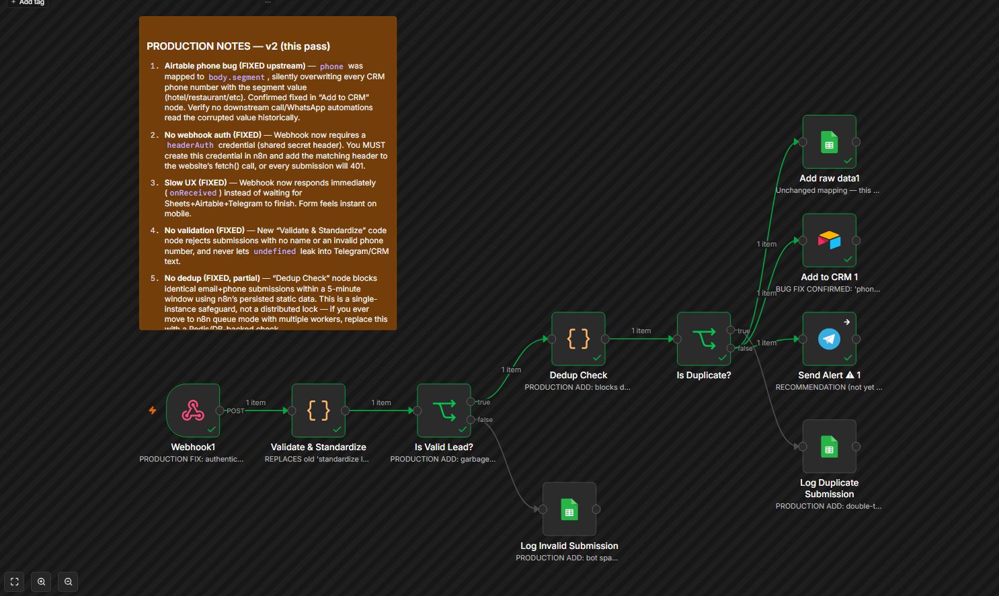
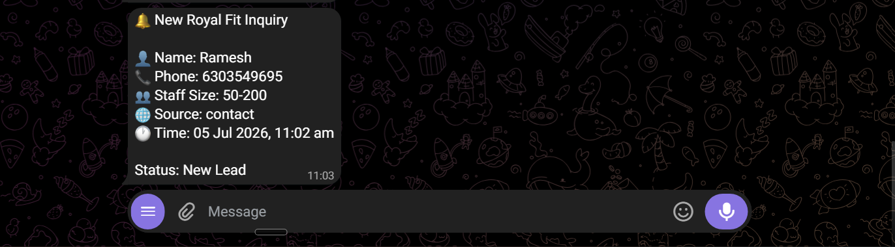

# Production Lead Pipeline for a B2B Uniform Supplier

**Stack:** n8n (self-hosted) · Google Sheets · Airtable · Telegram Bot API · JavaScript

A GTM system I built and run for Royal Fit Uniform, a real B2B supplier serving
hotels, hospitals, and hospitality chains across South India. This isn't a demo
workflow — it's the actual pipeline that catches every inbound lead from the
website and turns it into a CRM record and a real-time team alert, with its own
error-monitoring layer watching it in production.



---

### The problem

A lead fills out a form on the website. From there, three things need to happen
reliably: the lead needs to land in the CRM correctly, the team needs to know
about it within seconds, and none of that should ever silently fail without
someone finding out.

### The system

```text
Website Form → Webhook (authenticated) → Validate & Standardize
     → Duplicate check (5-min window)
          → Google Sheets (audit log)
          → Telegram (instant team alert)
          → Airtable (CRM record)

Any failure anywhere → dedicated error workflow
     → Telegram alert + error log, with a direct link to the failed execution
```

Every inbound POST is authenticated with a shared secret header. Malformed or
incomplete submissions are validated out before they ever touch the CRM.
Duplicate submissions — someone double-tapping "Submit" on a slow connection —
are caught and logged instead of creating two CRM records and firing two alerts.



### The bug that made this worth writing about

Partway through running this in production, I found that the Airtable node was
writing every lead's phone number field from the *segment* value instead of the
actual phone number — "hotel," "restaurant," whatever the person selected,
overwriting the real number every time.

The workflow's execution log showed "Succeeded" on every single run. There was
no error, because there was no failure — just a field pointed at the wrong
source. It only surfaced because a parallel Google Sheets log, mapped
correctly, didn't match what was in Airtable.


**The takeaway:** a green checkmark on an automation means it ran without
throwing. It says nothing about whether the data going in is actually correct.
Field-mapping bugs are invisible to error monitoring by definition — the only
way to catch them is auditing the output against a second source of truth,
which is exactly why the raw Sheets log exists as a parallel branch and not
just a nice-to-have.

### What this demonstrates

- Designing for graceful degradation — one branch failing (Telegram, say)
  never blocks the CRM write or the audit log
- Building validation and dedup logic directly into the automation layer,
  not assuming the frontend form handles it
- Running a dedicated error-monitoring workflow so failures produce an alert
  and an audit trail instead of disappearing
- Auditing production data against a source of truth, not just trusting
  execution status


---

*Full sanitized workflow JSON and setup documentation available on
[GitHub →]()*
